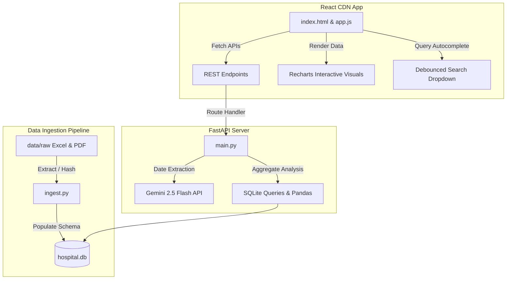

# Hospital Revenue Leakage & Surgery Audit Dual Chatbot Code Documentation

Welcome to the technical code documentation for the **Hospital Revenue Leakage & Surgery Audit Dual Chatbot** project. This document provides an in-depth breakdown of the system architecture, file structures, logical modules, database schemas, and the coding paradigms employed across the codebase.

---

## 1. System Overview

This application is a full-stack, AI-powered diagnostic and auditing tool for hospital administration. It provides a dual-chatbot interface powered by **Google Gemini 2.5 Flash** to analyze complex hospital billing records:
1. **Revenue Leakage Chatbot:** Focused on identifying missed charges, identifying department-wise and staff-wise leakage, and analyzing trend lines.
2. **Surgery Audit Chatbot:** Focused on cross-referencing actual scheduled surgery logs with billed procedures recorded in the Hospital Information System (HIS).

### Key Architectural Pillars
- **Zero-Node React Frontend:** Built using React 18 and Recharts via standard CDN scripts. This bypasses the need for high-overhead local package builds (like npm/Vite) while maintaining a modern, responsive, component-based user interface.
- **FastAPI REST Backend:** Built using Python's modern, lightweight, high-performance API framework. It serves as the bridge between the SQLite database, data analysis pipelines, and the Google Gemini API.
- **Robust Ingestion Pipeline:** Implemented using `pandas` and `pdfplumber` to process large-scale Excel and PDF billing files, parse their structure dynamically, and populate a structured local SQLite database.
- **Gemini NLP Integration:** Utilizes the generative intelligence of Gemini to perform semantic queries, extract temporal filters (dates) from free-form natural language, and render high-fidelity analytical reviews.

---

## 2. System Architecture

The project follows a standard decoupled full-stack architecture. For deployment ease, a utility script (`inline.py`) is also provided to compile the frontend assets into a single, cohesive file.



---

## 3. Data Ingestion Layer (`backend/ingest.py`)

The ingestion script is responsible for cleaning, structuring, hashing, and writing raw Excel and PDF files into the local SQLite database.

### 3.1 Database Initialization (`init_db`)
Initializes the SQLite database at `db/hospital.db` and establishes the tables structure:
- **`locations`**: Contains ward and ICU metadata.
- **`soc_rates`**: Holds Standard Rate of Charges (SOC) data.
- **`revenue_4a`**: Stores raw revenue leakage entries (daily service and staff-specific).
- **`audit_4b_4d`**: Stores comparison audits between actual surgeries and HIS billed procedures.

### 3.2 Ingesting Locations (`ingest_locations`)
Parses `ICU + Ward List.xlsx` in `data/raw/` to find unique ward and ICU labels. It dynamically extracts column titles matching standard patterns and stores them as distinct strings in the `locations` table.

### 3.3 Ingesting Standard Charges (`ingest_soc`)
Accesses `Amrita Hospital SOC - 2022-23_03-01-2024..pdf` to capture the base price mappings for services. It parses the first few pages using `pdfplumber` and executes fallback inserts to populate standard service rates.

### 3.4 Ingesting Revenue 4A (`ingest_4a`)
Processes Excel files prefixed with `IH_4A_` in `data/raw/`. It performs two critical extraction stages:
1. **Daily Service Leakage (`Summary_Final` sheet):** Analyzes the overall service-level leakage totals.
2. **Staff-Specific Gaps (`Billing staff leakage` sheet):** Dynamically locates the headers for dates, shift staff, location, and billing discrepancy amounts. It resolves missing billing gaps for specific services by cross-checking column indexes against the valid services list.

#### Deduplication Mechanism:
To avoid duplicate imports on subsequent runs, it generates a unique MD5 hash for each record based on its fields:
```python
def generate_hash(*args):
    s = "".join([str(a) for a in args])
    return hashlib.md5(s.encode()).hexdigest()
```
The query uses `INSERT OR IGNORE` to bypass records with matching `hash_key` fields.

### 3.5 Ingesting Surgery Audit 4B/4D (`ingest_4b_4d`)
Processes Excel files matching `IH_4B_*.xlsx` and `IH_4D_*.xlsx` (Surgery package audits).
- It opens the `Procedure detail` sheet.
- Identifies critical fields dynamically: Date, Patient MRD ID, Actual Procedure scheduled, Billed HIS Procedure, Primary Surgeon, Medical Speciality, and financial difference amount.
- Generates a unique MD5 hash per row and saves it to the `audit_4b_4d` table.

---

## 4. Backend API Layer (`backend/main.py`)

The API server coordinates web traffic, queries the SQLite database using `pandas`, runs the Gemini NLP engine, and formats analytical responses for the React frontend.

### 4.1 CORS & Global Configurations
Enables Cross-Origin Resource Sharing (CORS) for all origin paths to allow React web clients running on custom ports to interact with FastAPI.
```python
app.add_middleware(
    CORSMiddleware,
    allow_origins=["*"],
    allow_credentials=True,
    allow_methods=["*"],
    allow_headers=["*"],
)
```

### 4.2 Login Endpoint (`POST /login`)
Implements role-based routing controls for multiple user profiles:
- **`Admin`** / **`Admin`**: Granted view permissions for **both** `revenue` and `audit` bots.
- **`Admin1`** / **`Admin1`**: Granted view permissions **only** for the `revenue` bot.
- **`Admin2`** / **`Admin2`**: Granted view permissions **only** for the `audit` bot.

### 4.3 Timeline NLP Extraction (`extract_dates_from_query`)
A helper function that executes a zero-shot prompt using Gemini 2.5 Flash to automatically detect and normalize temporal expressions inside natural language queries.

```python
def extract_dates_from_query(query: str) -> dict:
    prompt = f"""
    Extract any start and end dates mentioned in the following user query: "{query}"
    Return ONLY a valid JSON object with the keys "start_date" and "end_date".
    Format the dates as "YYYY-MM-DD".
    ...
    """
    # Returns standard JSON: {"start_date": "2023-01-01", "end_date": "2023-08-31"}
```

This elegant mechanism frees the user from selecting date date-pickers manually while ensuring the SQL query matches their temporal intent.

### 4.4 Revenue Chat Engine (`POST /chat/revenue`)
Handles natural queries directed at the Revenue Leakage chatbot.
1. **Session Control:** Generates a unique UUID session ID if it's a new conversation, saving the session title to the `chat_sessions` database table.
2. **Filters & Date Validity Checks:** Applies start, end, and department/location filters. It checks if the requested NLP date ranges are completely outside the dataset's date bounds, automatically warning the user with a friendly error if they are.
3. **Data Aggregations:** Computes core business intelligence:
   - **Total Leakage:** Sum of all recorded leakage amounts.
   - **Unbilled Frequency:** Cases where services were delivered but zero bills were processed.
   - **Missed Services Top 5:** Top services missing from bills, grouped by service type.
   - **Offending Locations & Staff:** Top 5 departments and billing staff linked to high leakage sums.
   - **Monthly Growth:** Aggregates leakage over the most recent months.
4. **Gemini Context Prompting:** Sends all numerical metrics as localized context to Gemini to answer the user's questions accurately.
5. **Recharts Rendering Data Generator:** Analyzes the search terms to construct appropriate charting series (e.g. if the user asks about "staff", it packages the top staff leakage data; if they ask about "trends", it outputs monthly trends; otherwise, it defaults to location-wise leakage).

### 4.5 Surgery Audit Chat Engine (`POST /chat/audit`)
Processes requests targeting surgical packages and audits.
- Operates similarly to the Revenue engine but targets the `audit_4b_4d` database table.
- Aggregates discrepancy details, total audit loss, worst-performing specialties, and individual surgeon discrepancy metrics.
- Formats appropriate charts illustrating surgical loss categorized by medical specialty or surgeon.

### 4.6 File Upload Route (`POST /upload`)
Allows users to upload custom Excel sheets directly through the React dashboard. Files are stored inside `data/raw` and are ready for the ingestion pipeline on demand.

---

## 5. Frontend Application Layer (`frontend/`)

The frontend is a single-page application built on a curated, high-end visual design system.

### 5.1 Color Scheme & Design Elements
The styling represents a sophisticated, warm-minimalist aesthetic (a high-end Scandinavian museum look) defined via extending Tailwind configurations:
- **`primary` (`#E3DAC9`)**: Warm bone/cream canvas color.
- **`secondary` (`#C2B8A3`)**: Muted beige for side panels.
- **`dark` (`#A19782`)**: Warm gray for text and secondary details.
- **`darker` (`#5E574B`)**: Umber charcoal for primary buttons and user speech bubbles.
- **`darkest` (`#2B2823`)**: Off-black for dominant typography and active widgets.
- **Typography:** DM Serif Display for premium headings and DM Sans for highly readable body copy.

### 5.2 Application State Management (`App` Component)
Manages crucial UI states:
- `user`: Holds current session profile.
- `bot`: Mappings to active view pane (`revenue` or `audit`).
- `messages`: Historical logs categorized by bot view.
- `locations`: Active location listings fetched on load.
- `filters`: Global date range constraints.
- `sessions`: Side panel collection of historical chat sessions.
- `currentSessionId`: Keeps track of active session UUIDs.
- `isTyping`: Renders an elegant typing placeholder during Gemini API calls.

### 5.3 Auto-Suggest Dropdown (`AutocompleteSearch` Component)
An intelligent search panel that handles dynamic query inputs:
- **Debounced Fetching:** Features a custom 300ms debounce timeout using React `useRef` to throttle autocomplete network requests.
- **Location Extract Hook:** Automatically extracts ward names appended to static suggestions (e.g. `"Which floor has the highest leakage - ICU?"` becomes query: `"Which floor has the highest leakage?"` and filters data for `"ICU"`).

### 5.4 Recharts Integration
React mounts Recharts from global browser namespaces in CDN mode:
```javascript
const RechartsComponents = window.Recharts || {};
const { BarChart, Bar, XAxis, YAxis, CartesianGrid, Tooltip, ResponsiveContainer, LabelList } = RechartsComponents;
```
It renders dynamic bar charts inside chat logs. The chart auto-formats numeric axes based on value types: counts remain integers, while values render in currency with Indian formatting (₹ with Lakh/Crore scales).

---

## 6. Utilities & Test Suites

### 6.1 Inline Compiler (`inline.py`)
A convenience utility that bundles separate React and JavaScript assets into a single static file for easy distribution:
- It changes directory scope to the project root.
- Reads raw files `frontend/index.html` and `frontend/app.js`.
- Replaces `<script type="text/babel" src="app.js?v=4"></script>` with the complete, raw contents of `app.js` wrapped inside an inline script tag.
- Overwrites `frontend/index.html` with the compiled single-file output.

### 6.2 Date Extraction Test (`test_date_extraction.py`)
Validates NLP date parsing:
- Imports `extract_dates_from_query` from `backend.main`.
- Passes test queries (e.g., `"revenue leakage in May 2022"`, `"surgery audit from june 2024 to october 2025"`).
- Prints resulting dictionary outputs to confirm correct temporal bounds detection.

### 6.3 Surgery Audit Test (`test_audit.py`)
Processes offline queries and tests DB connections:
- Appends the backend system path.
- Resolves date range bounds using mock query strings.
- Manually establishes connections to `db/hospital.db`.
- Tests SQL queries and filters, verifying date ranges, total loss values, and row matches.

---

## 7. Database Schemas Reference

Below is the database table configuration showing key fields and column types:

### Table: `locations`
| Column | Type | Constraints | Description |
| :--- | :--- | :--- | :--- |
| `id` | INTEGER | PRIMARY KEY AUTOINCREMENT | Unique ID |
| `type` | TEXT | | Location classification (e.g., 'ward') |
| `name` | TEXT | UNIQUE | Name of the hospital department or ward |

### Table: `soc_rates`
| Column | Type | Constraints | Description |
| :--- | :--- | :--- | :--- |
| `id` | INTEGER | PRIMARY KEY AUTOINCREMENT | Unique ID |
| `service_name` | TEXT | | Name of clinical service |
| `charge` | REAL | | Standard hospital charge amount |

### Table: `revenue_4a`
| Column | Type | Constraints | Description |
| :--- | :--- | :--- | :--- |
| `id` | INTEGER | PRIMARY KEY AUTOINCREMENT | Unique ID |
| `date` | TEXT | | Date of billing entry |
| `patient_id` | TEXT | | Patient identifier |
| `service_name` | TEXT | | Name of missed service |
| `billed_qty` | INTEGER | | Billed quantity |
| `actual_qty` | INTEGER | | Actually delivered quantity |
| `leakage_amount` | REAL | | Total revenue loss amount |
| `location` | TEXT | | Ward or ICU where leakage occurred |
| `staff_name` | TEXT | | Name of billing staff in charge |
| `hash_key` | TEXT | UNIQUE | Row-based MD5 string for deduplication |

### Table: `audit_4b_4d`
| Column | Type | Constraints | Description |
| :--- | :--- | :--- | :--- |
| `id` | INTEGER | PRIMARY KEY AUTOINCREMENT | Unique ID |
| `date` | TEXT | | Date of surgery |
| `patient_id` | TEXT | | Patient Medical Record ID |
| `actual_procedure`| TEXT | | Scheduled procedure details |
| `billed_procedure`| TEXT | | Procedure entered into HIS billing system |
| `surgeon` | TEXT | | Name of primary surgeon |
| `speciality` | TEXT | | Medical specialty division |
| `difference_amount`| REAL | | Financial loss due to package discrepancies|
| `hash_key` | TEXT | UNIQUE | Row-based MD5 string for deduplication |

### Table: `chat_sessions`
| Column | Type | Constraints | Description |
| :--- | :--- | :--- | :--- |
| `session_id` | TEXT | PRIMARY KEY | Unique session UUID |
| `username` | TEXT | | Username of the logged-in administrator |
| `bot` | TEXT | | Chatbot type ('revenue' or 'audit') |
| `title` | TEXT | | Generated chat title (first 50 characters) |
| `created_at` | TIMESTAMP| DEFAULT CURRENT_TIMESTAMP| Time session was initialized |

### Table: `chat_messages`
| Column | Type | Constraints | Description |
| :--- | :--- | :--- | :--- |
| `id` | INTEGER | PRIMARY KEY AUTOINCREMENT | Message entry ID |
| `session_id` | TEXT | FOREIGN KEY | Associated session UUID |
| `role` | TEXT | | Speaker ('user' or 'bot') |
| `text` | TEXT | | Textual conversation content |
| `chart_data` | TEXT | | JSON string representing chart data |
| `chart_type` | TEXT | | Type of chart ('bar') |
| `chart_value_type`| TEXT | | Scaling units ('currency' or 'count') |
| `timestamp` | TIMESTAMP| DEFAULT CURRENT_TIMESTAMP| Epoch of message entry |

### Table: `audit_logs`
| Column | Type | Constraints | Description |
| :--- | :--- | :--- | :--- |
| `id` | INTEGER | PRIMARY KEY AUTOINCREMENT | Unique log entry identifier |
| `user_id` | TEXT | NOT NULL | Username of the logged-in administrator |
| `action_type` | TEXT | NOT NULL | Category of monitored action (e.g. QUERY_SUBMITTED) |
| `details` | TEXT | NOT NULL | JSON string documenting specific action data |
| `ip_address` | TEXT | | Client IP address |
| `timestamp` | DATETIME | DEFAULT CURRENT_TIMESTAMP | Date and time the action occurred |
| `session_id` | TEXT | | Associated conversation session UUID, if applicable |

---

This finishes the comprehensive code documentation. The architectures detailed above are designed for robust modularity, speed of analysis, and high-quality analytical intelligence.
